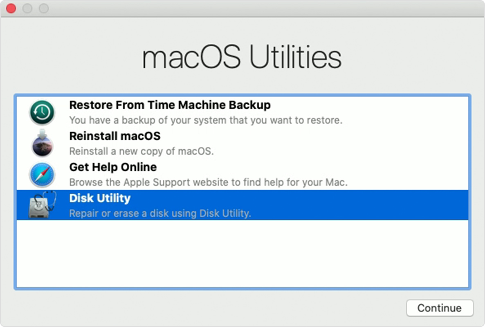
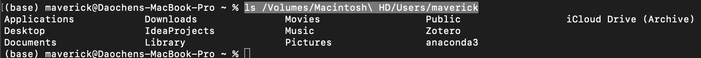

# MacOS升级卡死，如何紧急拷贝数据

## References

* [小红书](http://xhslink.com/gPbP0x)
* [File system formats](https://support.apple.com/guide/disk-utility/file-system-formats-dsku19ed921c/mac)

## Procedure

### 1. 准备苹果格式U盘/移动硬盘，用于拷贝数据

本文使用的格式是*Mac OS Extended (Case-sensitive, Journaled)*

### 2. 开机时长按`Command` + `R`，进入**macOS Utilities**


若进入**Internet Recovery**，本地Recovery Partition可能已经损坏，尝试走完Internet Recovery流程

### 3. 进入**Disk Utility**


### 4. 接入U盘/移动硬盘，选择Mount

如果格式不支持，需要格式化erase

### 5. **macOS Utilities** - Utilities - Terminal，打开终端


### 6. Terminal commands拷贝数据至U盘/移动硬盘

查看所有磁盘，确保U盘/移动硬盘Mount成功

```
ls /Volumes
```

查看用户`maverick`目录下文件

```
ls /Volumes/Macintosh\ HD/Users/maverick
```


拷贝数据

```
cp -rf /Volumes/Macintosh\ HD/Users/maverick/Documents /Volumes/TOSHIBA\ EXT/backup
```

用其他Mac打开U盘/移动硬盘，确保数据传输成功
