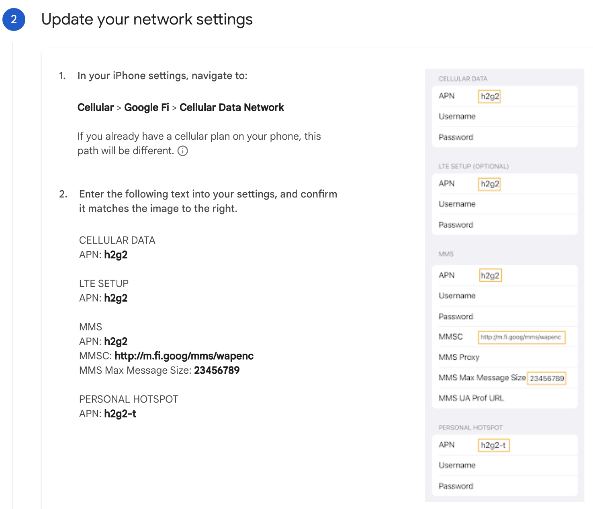

# Google Fi Cellular Data Troubleshooting

### Problem

When in Canada, Google Fi cellular data under *Simply Unlimited* plan shows up “**No Service**”.

### References

* { width=50% }

### Solution

#### Cellular Data

* **APN**: `h2g2`
* **Username**: leave blank
* **Password**: leave blank

#### LTE Setup (Optional)

* **APN**: `h2g2`
* **Username**: leave blank
* **Password**: leave blank

#### MMS

* **APN**: `h2g2`
* **Username**: leave blank
* **Password**: leave blank
* **MMSC**: [`http://m.fi.goog/mms/wapenc`](http://m.fi.goog/mms/wapenc)
* **MMS Proxy**: leave blank
* **MMS Max Message Size**: `23456789`
* **MMS UA Prof URL**: leave blank

#### Personal Hotspot

* **APN**: `h2g2-t`

### Screenshots
{ width=50% }